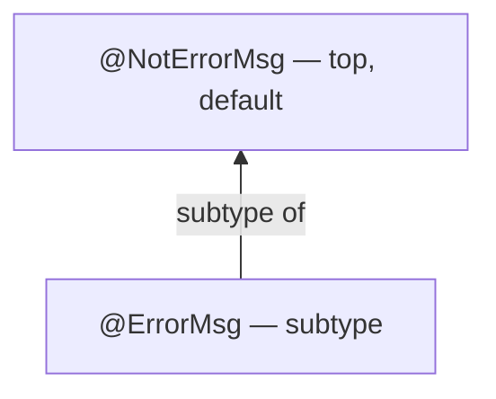
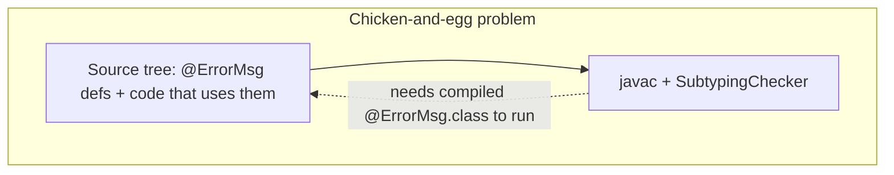
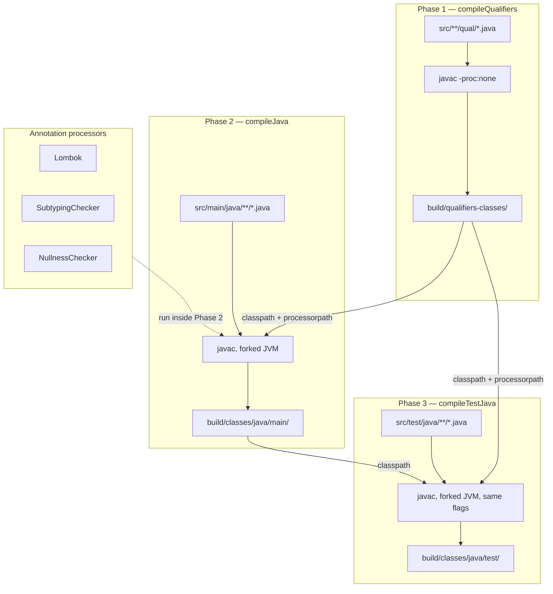

# Java is not always simpler

Person validation using **FunctionalJava**, **Lombok**, and the **Checker Framework** on Java 25.

## Approach

Java lacks built-in sum types (sealed interfaces arrived in Java 17 but without exhaustiveness in expressions),
algebraic data types, and concise data class syntax. This project compensates with three external tools:

- **FunctionalJava** provides `Validation<E, A>`, `NonEmptyList<E>`, and `Semigroup` — the core applicative
  error-accumulation machinery.
- **Lombok** (`@Value`) eliminates the boilerplate of writing constructors, getters, `equals`, `hashCode`, and `toString`
  by hand.
- **Checker Framework** with a custom **Subtyping Checker** introduces a compile-time type alias `@ErrorMsg String` to
  distinguish error message strings from regular strings at the type level.

### Validation logic

A reusable `check` helper wraps FunctionalJava's `Validation.condition` and lifts the result into `NonEmptyList`:

```java
public static <T> Validation<NonEmptyList<@ErrorMsg String>, T> check(
        final boolean c, final @ErrorMsg String e, final T t) {
    return condition(c, e, t).nel();
}
```

The `Person.of` factory validates each field independently, then accumulates errors via FunctionalJava's
`Validation.accumulate` with a `NonEmptyList` semigroup:

```java
var validatedName   = check(!name.isBlank(), NAME_EMPTY_OR_WHITESPACE_ERROR_MSG, name);
var validatedMinAge = check(age >= 0,        NEGATIVE_AGE_ERROR_MSG,             age);
var validatedMaxAge = check(age <= MAX_AGE,  MAX_AGE_ERROR_MSG,                  age);
return validatedName.accumulate(
    nonEmptyListSemigroup(), validatedMinAge, validatedMaxAge,
    (n, a1, a2) -> new Person(n, a1));
```

### Type-alias via Checker Framework

The `@ErrorMsg` / `@NotErrorMsg` annotations form a two-level subtyping hierarchy enforced at compile time:



This prevents accidentally passing an arbitrary `String` where an error message is expected, approximating a
newtype/type alias that Java does not natively support.

## Build walkthrough (`build.gradle.kts`)

The build is 146 lines. Below is a section-by-section explanation of *why* each piece exists and what problem it solves.
The complexity is not gratuitous — each block compensates for a gap in Java's language or tooling.

### Plugins (lines 1–5)

```kotlin
plugins {
  id("java-library")
  alias(libs.plugins.spotless)
  alias(libs.plugins.checkerFramework)
}
```

- **`java-library`** — standard Gradle plugin for JVM libraries. Provides the `compileJava`, `compileTestJava`, `jar`, and
  `test` tasks.
- **`spotless`** (`com.diffplug.spotless`, 8.2.1) — code formatting. Applied here rather than relying on IDE settings so
  that CI and every developer get identical formatting.
- **`checkerFramework`** (`org.checkerframework`, 1.0.2) — the Checker Framework Gradle plugin. It hooks into every
  `JavaCompile` task and adds the Checker Framework's annotation processors to the annotation processor path. In version
  1.0.x it also manages the `checker` and `checker-qual` dependencies automatically (they do not need to appear in the
  `dependencies` block).

### Java toolchain (lines 11–16)

```kotlin
java {
  toolchain {
    languageVersion.set(JavaLanguageVersion.of(25))
  }
  withSourcesJar()
}
```

Declares that this project requires JDK 25. Gradle's toolchain support will auto-detect or download an appropriate JDK.
`withSourcesJar()` publishes a `-sources.jar` alongside the main artifact.

### Dependencies (lines 18–39)

#### Lombok (lines 19–23)

```kotlin
compileOnly(libs.lombok)
annotationProcessor(libs.lombok)
testCompileOnly(libs.lombok)
testAnnotationProcessor(libs.lombok)
```

Lombok is wired manually rather than through the `io.freefair.lombok` plugin. This is deliberate: the freefair plugin
uses a **delombok** approach (generating plain Java source before compilation), which conflicts with the Checker
Framework plugin's own annotation-processor pipeline. Manual wiring with `compileOnly` + `annotationProcessor` lets both
Lombok and the Checker Framework run as annotation processors in a single javac invocation, in the correct order.

Four lines are needed because Lombok must be visible to both main and test compilation. `compileOnly` makes Lombok's
annotations available during compilation but excludes the jar from the runtime classpath (Lombok is purely a
compile-time tool). `annotationProcessor` places Lombok on the annotation processor path so javac will invoke its
processor.

#### Checker Framework (line 25)

```kotlin
// Plugin 1.0.x manages checker + checker-qual dependencies automatically
```

No explicit Checker Framework dependency is declared. The `org.checkerframework` plugin (version 1.0.2) creates a
`checkerFramework` configuration and adds both `org.checkerframework:checker` and `org.checkerframework:checker-qual`
at the version specified in the `checkerFramework { version = ... }` block. It also makes the `annotationProcessor`
configuration extend `checkerFramework`, so the checker's annotation processors are automatically on the processor
classpath.

#### Application libraries (lines 27–34)

Standard `implementation` dependencies: FunctionalJava for the validation pattern, Jackson for JSON, Typesafe Config,
and SLF4J. Jackson uses a BOM (`platform(libs.jackson.bom)`) so that individual Jackson module versions are managed
centrally.

#### Test libraries (lines 36–38)

TestNG as the test runner, AssertJ for fluent assertions, and Logback as the SLF4J backend during tests.

### The `compileQualifiers` bootstrap task (lines 41–60)

```kotlin
val compileQualifiers by tasks.registering(JavaCompile::class) {
  source = fileTree("src/main/java") { include("**/qual/*.java") }
  classpath = configurations.compileClasspath.get()
  destinationDirectory.set(layout.buildDirectory.dir("qualifiers-classes"))
  options.encoding = "UTF-8"
  options.release.set(25)
  options.compilerArgs.add("-proc:none")
}
```

**Why this exists:** the Checker Framework's SubtypingChecker needs to load the compiled `.class` files of custom
qualifier annotations (`@ErrorMsg`, `@NotErrorMsg`) at annotation-processing time. But these qualifiers live in the
same source tree as the code that uses them. If javac tries to compile everything at once with the checker enabled, the
checker fails because the qualifier classes don't exist yet — they are being compiled in the same pass that tries to
use them.



The solution is a two-phase compilation:

1. **Phase 1 (`compileQualifiers`)** — compile *only* the qualifier annotation files (`src/main/java/**/qual/*.java`) into
   `build/qualifiers-classes/`, with `-proc:none` to suppress all annotation processors (including the Checker Framework
   itself). This produces the `.class` files the checker needs.
2. **Phase 2 (`compileJava`)** — compile the rest of the source tree with the Checker Framework enabled, with the
   qualifier classes from Phase 1 on both the classpath and the annotation processor classpath.

Key details:

- `classpath = configurations.compileClasspath.get()` — the qualifier annotations reference Checker Framework types
  (`@SubtypeOf`, `@DefaultFor`, etc.), so they need `checker-qual` on the classpath to compile.
- `-proc:none` — critical. Without this, the Checker Framework plugin would try to run on the qualifier files themselves,
  failing because its own input (the qualifier classes) doesn't exist yet.
- The output goes to a separate directory (`build/qualifiers-classes/`) to avoid polluting the main build output.

### Wiring qualifier classes into compilation (lines 62–80)

```kotlin
for (taskName in listOf("compileJava", "compileTestJava")) {
  tasks.named<JavaCompile>(taskName) {
    dependsOn(compileQualifiers)
    val qualifierOut = files(compileQualifiers.map { it.destinationDirectory })
    classpath += qualifierOut
    options.annotationProcessorPath = files(
      options.annotationProcessorPath,
      qualifierOut
    )
  }
}
```

This loop configures both `compileJava` and `compileTestJava` to:

1. **`dependsOn(compileQualifiers)`** — ensure Phase 1 runs before Phase 2.
2. **`classpath += qualifierOut`** — make the compiled qualifier classes visible as regular dependencies. Without this,
   code that references `@ErrorMsg` or `@NotErrorMsg` would fail to compile.
3. **`options.annotationProcessorPath = files(..., qualifierOut)`** — append the qualifier classes to the annotation
   processor classpath. This is the critical part: the Checker Framework's SubtypingChecker loads qualifier annotations
   from the processor classpath, not the regular classpath. The plugin already populates `annotationProcessorPath` with
   the Checker Framework jars and Lombok; this line adds the project's own qualifier classes on top.

Without step 3, the SubtypingChecker would report that it cannot find the qualifier types specified in `-Aquals=...`,
even though they compile fine.

### Compiler options (lines 82–105)

```kotlin
tasks.withType<JavaCompile>().configureEach {
  options.encoding = "UTF-8"
  options.release.set(25)
  options.compilerArgs.addAll(listOf(
    "-parameters",
    "-Xmaxerrs", "10000",
    "-Xmaxwarns", "10000",
  ))
  options.isFork = true
  options.forkOptions.jvmArgs = listOf("--sun-misc-unsafe-memory-access=allow")
}
```

Applied to **all** `JavaCompile` tasks (including `compileQualifiers`):

- **`-parameters`** — retains method parameter names in bytecode. Required by Jackson's `ParameterNamesModule` for
  constructor-based deserialization without `@JsonProperty`.
- **`-Xmaxerrs 10000` / `-Xmaxwarns 10000`** — raises the javac error/warning limit. The Checker Framework can produce
  many warnings across a codebase; the default limit of 100 would truncate output.
- **`options.isFork = true`** + **`--sun-misc-unsafe-memory-access=allow`** — this exists **solely because
  of Lombok**. Lombok internally uses `sun.misc.Unsafe.objectFieldOffset()` (in `lombok.permit.Permit`) to
  reflectively access javac internals. Starting with JDK 24, this operation emits warnings by default ([JEP
  471](https://openjdk.org/jeps/471), [JEP 498](https://openjdk.org/jeps/498)). Forking javac into a separate JVM
  process allows passing the `--sun-misc-unsafe-memory-access=allow` flag to that JVM, silencing the warnings.
  This workaround is **not needed if Lombok is removed** (see the `java-no-lombok` subproject). JDK 26 moves to
  Phase 3 (throws by default); this flag will need updating when Lombok migrates off `sun.misc.Unsafe` ([tracking
  issue](https://github.com/projectlombok/lombok/issues/3852)).

### Test configuration (lines 107–112)

```kotlin
tasks.withType<Test>().configureEach {
  useTestNG { suites("testng.xml") }
  maxParallelForks = 1
}
```

Uses TestNG driven by the `testng.xml` suite file, with serial execution (`maxParallelForks = 1`).

### Spotless formatting (lines 114–132)

```kotlin
spotless {
  format("misc") {
    target(".gitattributes", ".gitignore")
    trimTrailingWhitespace()
    endWithNewline()
    leadingSpacesToTabs(2)
  }
  java {
    toggleOffOn()
    encoding("UTF-8")
    palantirJavaFormat(libs.versions.palantirJavaFormat.get()).apply {
      style("PALANTIR")
      formatJavadoc(false)
    }
    importOrder("", "\\#")
    removeUnusedImports()
    formatAnnotations()
  }
}
```

Enforces consistent formatting for all Java files using Palantir Java Format (a variant of Google Java Format with
120-char lines). `toggleOffOn()` enables `// @formatter:off` / `// @formatter:on` escape hatches. `formatAnnotations()`
handles Checker Framework type-use annotations correctly. The version is passed directly to `palantirJavaFormat()` as a
constructor argument to avoid a Gradle 9 Kotlin DSL method-name ambiguity with `version()`.

### Checker Framework configuration (lines 134–146)

```kotlin
checkerFramework {
  checkers = listOf(
    "org.checkerframework.common.subtyping.SubtypingChecker",
    "org.checkerframework.checker.nullness.NullnessChecker",
  )
  extraJavacArgs = listOf(
    "-Aquals=oscarvarto.mx.qual.ErrorMsg,oscarvarto.mx.qual.NotErrorMsg",
    "-Awarns",
  )
  excludeTests = false
  version = libs.versions.checkerframework.get()
}
```

- **`SubtypingChecker`** — a general-purpose checker that enforces user-defined subtyping hierarchies. It reads the
  `-Aquals` argument to discover which annotations form the hierarchy. Here it enforces `@ErrorMsg <: @NotErrorMsg`.
- **`NullnessChecker`** — enforces `@NonNull`/`@Nullable` contracts. All unannotated types default to `@NonNull`
  (Checker Framework's CLIMB-to-top default).
- **`-Aquals=oscarvarto.mx.qual.ErrorMsg,oscarvarto.mx.qual.NotErrorMsg`** — tells the SubtypingChecker which annotation
  classes define the custom type hierarchy.
- **`-Awarns`** — reports Checker Framework findings as warnings instead of errors. This allows the build to succeed
  with warnings during development; change to `-Aerror` to make violations fail the build.
- **`excludeTests = false`** — runs checkers on test code too, not just main sources.
- **`version`** — pins the Checker Framework version (3.53.1) via the version catalog.

## The `lombok.config` file

Lombok reads this file at build time to configure its code generation behavior:

```properties
lombok.accessors.chain = true
lombok.equalsAndHashCode.callSuper = call
lombok.addLombokGeneratedAnnotation = true
lombok.addNullAnnotations = checkerframework

# Copy Checker Framework annotations to generated code
lombok.copyableAnnotations += oscarvarto.mx.qual.ErrorMsg
lombok.copyableAnnotations += oscarvarto.mx.qual.NotErrorMsg

# Also copy Checker Framework's own annotations
lombok.copyableAnnotations += org.checkerframework.framework.qual.SubtypeOf
lombok.copyableAnnotations += org.checkerframework.framework.qual.DefaultFor
lombok.copyableAnnotations += org.checkerframework.framework.qual.DefaultQualifierInHierarchy
lombok.copyableAnnotations += org.checkerframework.framework.qual.QualifierForLiterals
```

- **`addLombokGeneratedAnnotation = true`** — marks all Lombok-generated methods with `@lombok.Generated`. The Checker
  Framework plugin recognizes this annotation and suppresses warnings in generated code, preventing false positives from
  code the developer didn't write.
- **`addNullAnnotations = checkerframework`** — makes Lombok emit `@NonNull`/`@Nullable` (from `checker-qual`) on
  generated code (getters, constructors, `equals` parameter) so the NullnessChecker sees correct nullability contracts.
- **`copyableAnnotations`** — by default, Lombok strips unknown annotations from generated code. These lines tell Lombok
  to **preserve** the custom `@ErrorMsg`/`@NotErrorMsg` annotations (and the Checker Framework's own meta-annotations)
  when generating getters, constructors, etc. Without this, a field declared as `@ErrorMsg String errorMsg` would lose
  the `@ErrorMsg` annotation on its generated getter.

## Compilation phases (summary)

The full compilation pipeline for a `./gradlew build`:



## Pros

- Java is the most widely adopted JVM language; the ecosystem and tooling are unmatched in breadth.
- FunctionalJava is a mature, well-tested library that provides a faithful implementation of the Validation applicative.
- The Checker Framework adds compile-time guarantees (nullness, custom type qualifiers) that go beyond what Java's type
  system offers out of the box.
- Lombok drastically reduces ceremony for data-carrying classes.

## Cons

- **Build complexity** — the Gradle build is the most involved of all subprojects, with annotation processor ordering,
  multi-phase compilation, and JVM flag workarounds.
- **Library stacking** — three separate libraries (FunctionalJava, Lombok, Checker Framework) are needed to approximate
  what other languages provide natively or with a single library.
- **Error messages are strings** — even with `@ErrorMsg`, errors are still `String` values at runtime, not typed sealed
  members. Pattern matching on error kinds requires string comparison.
- **Verbose despite Lombok** — the overall ceremony (imports, static methods, annotation wiring) is still heavier than
  the Kotlin or Scala equivalents.

## Running

```bash
./gradlew test
```

## Key Dependencies

| Library             | Version         | Role                                        |
| ------------------- | --------------- | ------------------------------------------- |
| FunctionalJava      | 5.0             | `Validation`, `NonEmptyList`, `Semigroup`   |
| Lombok              | 1.18.42         | `@Value` for data classes                   |
| Checker Framework   | 3.53.1          | `@ErrorMsg` type alias via SubtypingChecker |
| Spotless + Palantir | 8.2.1 / 2.88.0  | Code formatting                             |
| TestNG + AssertJ    | 7.12.0 / 3.27.7 | Testing                                     |
